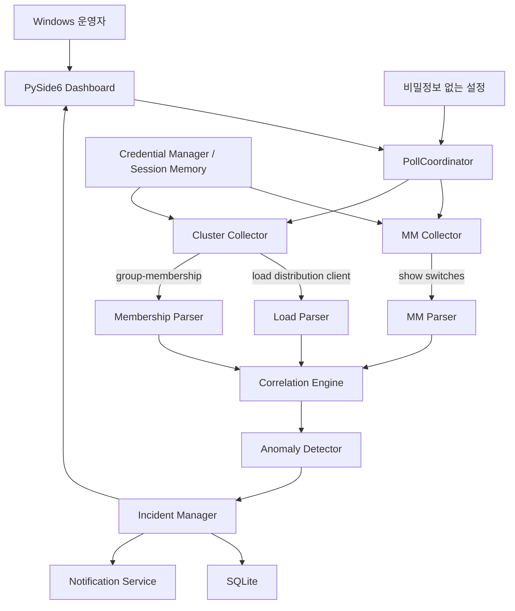
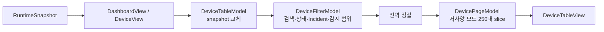

# Aruba MM / WLC 모니터링 구조

이 문서는 장비 조회부터 Parser, 상태 판단, 사건 관리, UI 표시까지의 책임 경계를 설명합니다.

## 1. 전체 구조



핵심은 **수집과 장애 판단을 분리하는 것**입니다. SSH가 실패했다고 해서 Collector가 장비를 Down으로 만들지 않으며, Parser가 만든 관측값과 수집 신뢰도를 Correlation 계층이 함께 해석합니다.

## 2. 구성요소별 책임

### Collector

`collectors/`는 장비 접속과 허용된 명령 실행을 담당합니다.

- MM: `show switches`
- Cluster: `show lc-cluster load distribution client`
- Cluster: `show lc-cluster group-membership`
- Primary Controller 실패 시 등록된 Fallback 순서로 조회
- 실제 명령을 수행한 Controller 정보를 결과에 남김
- SSH 호스트 키 확인과 취소 가능한 연결 처리

Collector는 장애 원인을 추정하지 않습니다.

### Parser

`parsers/`는 CLI 원문을 구조화된 관측값으로 변환합니다.

- ANSI/헤더/부분 행 등 출력 변형 처리
- 유효하게 읽을 수 있는 행과 불완전한 수집 상태 분리
- 수집 실패를 임의의 정상/Down 값으로 채우지 않음

### Anomaly Detector

`services/anomaly_detector.py`는 시간 축을 포함한 이상 판단을 담당합니다.

기본 설정은 다음과 같습니다.

| 항목 | 기본값 |
|---|---:|
| 낮은 Active Client 절대 기준 | 10 |
| 이상 확정 | 3회 연속 |
| 복구 확정 | 2회 연속 |
| Peer 대비 비율 기준 | 25% |
| Cluster 전체 Active 최소 기준 | 50 |
| Peer 중앙값 최소 기준 | 30 |
| 구성원 누락 확정 | 3회 연속 |

단일 숫자 하나만으로 장애를 확정하지 않고 절대값, 상대값, Cluster 전체 사용량과 연속 관측을 조합합니다.

### Correlation Engine

`services/correlation_engine.py`는 서로 다른 명령의 결과를 **장비 IP 기준**으로 연결합니다.

예를 들어 같은 IP에서 다음 두 신호가 동시에 발생할 수 있습니다.

```text
show switches          → Controller Down
load distribution      → Active Client 이상
```

이 경우 화면에는 별도 행 두 개가 아니라 같은 장비의 복수 원인으로 누적합니다.

또한 수집 자체가 실패한 경우에는 실제 장비 상태와 구분하여 `확인 불가` 또는 부분 수집으로 유지합니다.

### Incident Manager

`services/incident_manager.py`는 상태의 lifecycle을 관리합니다.

```text
정상
 ↓
이상 관측
 ↓
사건 활성
 ↓
운영자 확인 ──→ 장애 감시는 계속
 ↓
복구 조건 충족
 ↓
복구 기록
```

운영자가 알림을 확인했다고 장애 자체를 정상으로 변경하지 않습니다. 확인 상태는 반복 알림 제어용이며 실제 복구는 별도 조건을 충족해야 합니다.

### PollCoordinator

`services/poll_coordinator.py`는 UI와 수집 작업 사이의 실행 순서를 관리합니다.

- 수동 점검
- 자동 점검
- 중복 점검 방지
- Worker Thread 실행
- 종료/취소
- 다음 점검 시각

네트워크 I/O가 Qt GUI thread를 직접 점유하지 않도록 분리합니다.

### Storage

`storage.py`의 SQLite는 다음과 같은 로컬 운영 상태를 보존합니다.

- 최근 관측/최근 정상 상태
- Connection-Type baseline
- anomaly/recovery streak
- 사건/확인/복구 상태
- 사건 전이 이벤트 이력
- 일부 UI/운영 설정 미러

원본 명령 출력과 비밀번호는 SQLite에 저장하지 않습니다.

손상되거나 지원할 수 없는 기존 상태를 읽지 못한 경우 빈 DB처럼 계속 운용하지 않고, 원본을 보존하고 자동 점검을 중지한 격리 상태로 전환합니다.

## 3. 상태 계산의 신뢰도 경계

프로그램은 다음 두 종류를 구분합니다.

### 장비 상태 증거

- 정상 수집된 `show switches`의 명시적 Down
- 정상 Parser 결과의 Client 분배 이상
- 정상 Membership 결과의 Connection-Type 변화

### 수집 상태 증거

- SSH 연결 실패
- Timeout
- 명령 실패
- 빈 출력
- Parser 실패/부분 수집

두 번째 범주는 장비 Down의 직접 증거가 아닙니다.

```text
수집 실패 ≠ 장비 장애
```

이 원칙은 False Positive를 줄이기 위한 핵심 안전 경계입니다.

## 4. Primary / Fallback

Cluster 상태 조회는 운영자가 등록한 Primary부터 시작합니다.

```text
Primary
   ↓ 실패
Fallback #1
   ↓ 실패
Fallback #2
   ↓
수집 결과
```

Fallback에서 정상 수집되더라도 어떤 Controller가 실제 수집을 수행했는지 별도로 기록합니다. 따라서 수집 경로가 바뀐 사실과 Cluster 상태 자체를 혼동하지 않습니다.

## 5. UI 계층

PySide6 UI는 도메인 상태를 다시 계산하지 않고 Correlation/Incident 결과를 표시합니다.

주요 표시 항목:

- 종합 상태
- 문제 IP
- 판단 근거
- MM 보고 상태
- Active / Standby Client
- Connection-Type
- 분배 상태
- 마지막 점검 시각

폭이 작은 창은 등록된 Controller의 핵심 상태에 집중하고, 넓은 창은 전체 장비 정보를 표시합니다.

### 장비표 Model/View 흐름

넓은 화면의 전체 장비표는 다음 파이프라인을 사용합니다.



- `DeviceTableModel` 은 `DeviceView` snapshot, 활성 Incident IP, 감시 범위 IP를
  한 번에 교체하며 Qt role로 표시·정렬·접근성 데이터를 제공합니다.
- `DeviceFilterModel` 이 검색·상태·문제만 보기·감시 대상만 보기와 정렬을
  전체 결과에 먼저 적용합니다.
- `DevicePageModel` 은 정렬된 필터 결과를 나중에 페이지로 잘라냅니다.
  따라서 페이지 내부만 정렬되는 오류를 만들지 않습니다.
- 선택은 표 행 번호가 아닌 장비 IP role을 식별자로 복원합니다. 필터,
  정렬, 페이지, compact/full 반응형 전환으로 행 위치가 바뀌어도 선택
  대상을 행 위치와 혼동하지 않습니다.

### 운영 개요와 세션 추세

`OverviewPage` 는 이미 만들어진 `DashboardView`/`DeviceView`와 Incident lifecycle
상태를 요약해 전체 상태, Controller Up, Active Client, 활성 Incident를
표시합니다. ACK는 알림 확인이지 복구가 아니므로 Incident 건수는
`active` lifecycle 값만 기준으로 계산합니다. 대규모 inventory에서도 QWidget을
장비 수만큼 만들지 않도록 Controller 카드는 앞의 8대까지만 만들고 나머지는
전체 장비표로 안내합니다.

`CompactPage` 는 작은 창의 위젯 구성과 이미 파생된 `DeviceView` 행 표현만
소유합니다. `MainWindow` 는 두 page의 합성, PollCoordinator 신호, system tray,
전역 메뉴와 기존 900/1000px 반응형 전환을 계속 소유합니다.

Active Client sparkline은 `OverviewPage` 내부의 최대 60개 `deque`에만
유지됩니다. 이 값은 표현용 세션 데이터이며 `AppSettings`, JSON, SQLite 및
사건 저장소에 쓰지 않습니다. 프로세스를 종료하면 사라지므로 장기
시계열 데이터로 해석하면 안 됩니다.

### 최근 이벤트 조회

`MainWindow` 는 최근 이벤트 표시를 위해 SQLite 연결이나 SQL에 직접
접근하지 않습니다. 주입된 저장소의 기존 공개
`SQLiteStorage.list_events(limit=10)`을 호출하면 저장소가 새 이벤트부터
내림차순으로 반환합니다. UI는 이 결과를 운영용 요약으로 변환하고 최대
5개를 표시합니다. 이벤트 조회나 표현이 실패해도 보조 UI만
`불러오기 지연`으로 표시하고 PollCoordinator·Incident Manager·저장 처리에
영향을 주지 않습니다.

## 6. 외부 전송 경계

프로그램은 중앙 서버나 클라우드 텔레메트리를 사용하지 않습니다.

- 상태 저장: 로컬 SQLite
- 설정: 로컬 JSON
- 자격 증명: Windows Credential Manager 또는 세션 메모리
- 알림: Windows 로컬 알림/Tray

실제 운영 데이터의 외부 전송 기능은 현재 설계 범위에 없습니다.


## v0.6.0 명시적 장애조치 합성

`main.py`가 `MainWindow`를 만든 뒤 `RemediationFeatureController`를 명시적으로
합성합니다. 런타임 클래스 교체는 사용하지 않습니다. 장애조치 UI, Workflow, KST,
SSH Operation Registry와 원자적 SQLite 저장소는 독립 모듈이며 실패해도 기존
읽기 전용 대시보드 시작을 막지 않습니다.
